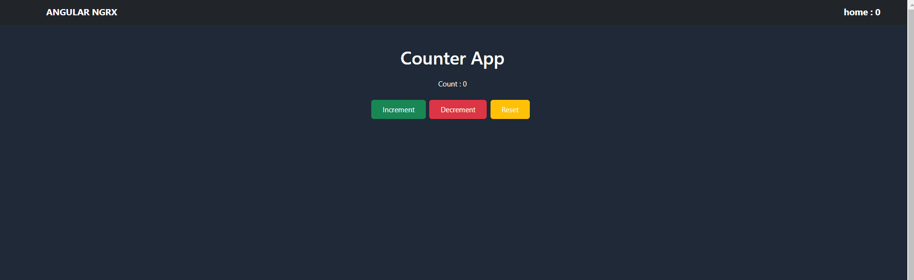

# NgRx-counter-app

This project highlights the benefits of NgRx over traditional observable patterns. By centralizing state, It demonstrates the power of state management using NgRx across different components. It illustrates how to handle state changes efficiently using actions, reducers, and selectors.
